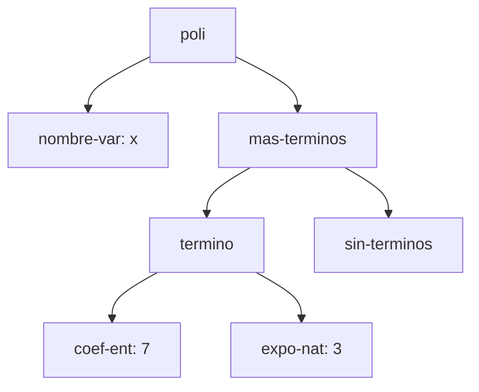
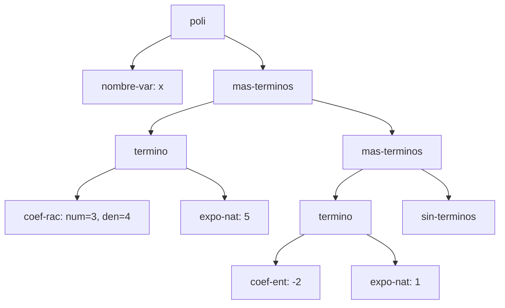
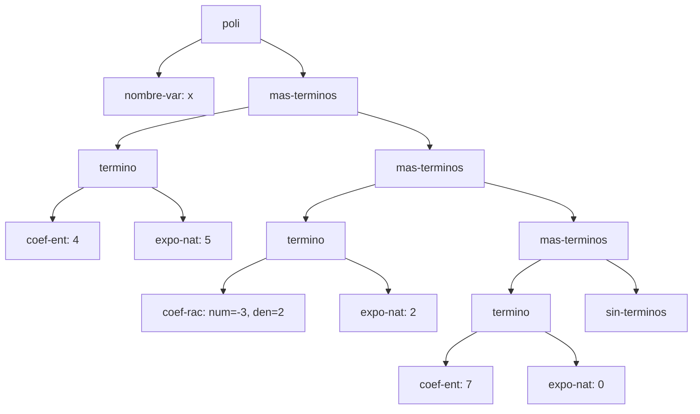
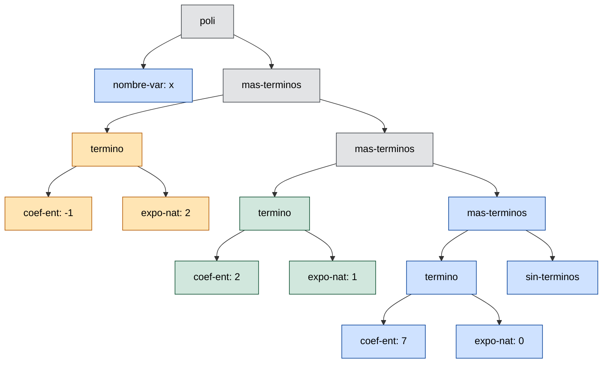

# Informe de AST — Taller 1: polinomios dispersos

**Curso:** Fundamentos de Interpretación y Compilación de Lenguajes
de Programación — Universidad del Valle, Sede Tuluá.

**Integrantes del grupo:**

| Nombre | Código | Correo institucional |
|--------|--------|----------------------|
| Maria Fernanda Betancourt Montoya | 2459510 | maria.fernanda.betancourt@correounivalle.edu.co |
| Oliver De Jesus Arboleda Baez | 2459684 | oliver.arboleda@correounivalle.edu.co |
| Kevin Andres Rosero Romo | 2459554 | rosero.kevin@correounivalle.edu.co |

---

## 1. Gramática considerada

Esta es la gramática del enunciado. Los nombres del recuadro son los
constructores que aparecen como etiquetas en los diagramas de la
sección 2

```bnf
<polinomio>   ::= <variable> <terminos>
                   poli(var, terms)

<variable>    ::= <symbol>
                   nombre-var(s)

<terminos>    ::= '()
                   sin-terminos()
              ::= <termino> <terminos>
                   mas-terminos(term, resto)

<termino>     ::= <coeficiente> <exponente>
                   termino(coef, expo)

<coeficiente> ::= <int>
                   coef-ent(n)
              ::= <int> "/" <int>
                   coef-rac(num, den)

<exponente>   ::= <int>
                   expo-nat(k)
```

Así se realiza cada no terminal en la implementación con
`define-datatype`:

| No terminal | Tipo del datatype | Variantes | Campos |
|---|---|---|---|
| `<polinomio>` | `polinomio` | `poli` | `var`, `terms` |
| `<variable>` | `variable` | `nombre-var` | `s` |
| `<terminos>` | `terminos` | `sin-terminos`, `mas-terminos` | `sin-terminos`: ninguno; `mas-terminos`: `term`, `resto` |
| `<termino>` | `termino-tad` | `termino` | `coef`, `expo` |
| `<coeficiente>` | `coeficiente` | `coef-ent`, `coef-rac` | `coef-ent`: `n`; `coef-rac`: `num`, `den` |
| `<exponente>` | `exponente` | `expo-nat` | `k` |

El tipo de `<termino>` se llama `termino-tad` porque `define-datatype`
no admite que el tipo se llame igual que su única variante, `termino`.

**Cómo leer los árboles.** Cada nodo lleva el nombre de un constructor
de la gramática. Las hojas `nombre-var`, `coef-ent`, `coef-rac` y
`expo-nat` llevan además el valor de sus campos. Una lista de términos
es una cadena: cada `mas-terminos` tiene dos hijos, el término de la
cabeza (`term`) y el resto de la lista (`resto`), y la cadena termina
siempre en `sin-terminos`.

---

## 2. Ejemplos de AST

### Ejemplo 1 — un solo término con coeficiente entero

**Polinomio:** $p_1 = 7x^{3}$

**Construcción:**

```scheme
(poli (nombre-var 'x)
      (mas-terminos (termino (coef-ent 7) (expo-nat 3))
                    (sin-terminos)))
```

**AST:**



**Explicación:** la raíz `poli` tiene dos hijos: el campo `var`, que es
la hoja `nombre-var: x`, y el campo `terms`, que es la lista de
términos. Como el polinomio tiene un solo término, la lista es un
`mas-terminos` cuyo `term` es el único `termino` y cuyo `resto` es
`sin-terminos`, que cierra la lista. El coeficiente y el exponente son
nodos separados porque son dos campos distintos de `termino`
(`coef` y `expo`) y pertenecen a categorías distintas de la gramática:
el coeficiente puede ser entero o racional (`coef-ent` o `coef-rac`),
mientras que el exponente siempre es un natural (`expo-nat`).

---

### Ejemplo 2 — dos términos, uno con coeficiente racional

**Polinomio:** $p_2 = \frac{3}{4}x^{5} - 2x$

**Construcción:**

```scheme
(poli (nombre-var 'x)
      (mas-terminos (termino (coef-rac 3 4) (expo-nat 5))
                    (mas-terminos (termino (coef-ent -2) (expo-nat 1))
                                  (sin-terminos))))
```

**AST:**



**Explicación:** el subárbol de `coef-rac` almacena dos enteros, el
numerador y el denominador, por separado, mientras que `coef-ent` guarda un único entero
`n`. En el árbol, el término de exponente 5 está en el primer
`mas-terminos` y el de exponente 1 en el siguiente, de modo que al bajar
por la cadena de `resto` los exponentes van disminuyendo
($5 > 1$). Eso es el orden estricto decreciente que exige el
invariante, y es la única forma válida de representar este polinomio:
la lista con los términos al revés no cumple $\mathrm{Inv}$.

---

### Ejemplo 3 — tres o más términos, con término independiente

**Polinomio:** $p_3 = 4x^{5} - \frac{3}{2}x^{2} + 7$

**Construcción:**

```scheme
(poli (nombre-var 'x)
      (mas-terminos (termino (coef-ent 4) (expo-nat 5))
                    (mas-terminos (termino (coef-rac -3 2) (expo-nat 2))
                                  (mas-terminos (termino (coef-ent 7) (expo-nat 0))
                                                (sin-terminos)))))
```

**AST:**



**Explicación:** el término independiente $7$ es el término
$7x^{0}$, así que se representa como cualquier otro `termino`, con
`coef-ent: 7` y `expo-nat: 0`. Su exponente sigue siendo un nodo
`expo-nat` porque la gramática no tiene un constructor especial para
constantes: $0$ es un exponente natural válido (condición 3 del
invariante) y, al ser el menor, el término independiente queda siempre
al final de la lista, justo antes de `sin-terminos`. El árbol tiene
tres `mas-terminos` encadenados, uno por término, y los exponentes
$5 > 2 > 0$ decrecen al bajar.

---

### Ejemplo 4 — el resultado de `(sumar p q)`

Se usan los polinomios $p$ y $q$ del ejemplo de la Parte 3 del
enunciado.

**Operandos:**

- $p = 4x^{5} - \frac{3}{2}x^{2} + 7$, con términos
  $(4, 5)$, $\left(-\frac{3}{2}, 2\right)$ y $(7, 0)$.
- $q = -4x^{5} + \frac{1}{2}x^{2} + 2x$, con términos
  $(-4, 5)$, $\left(\frac{1}{2}, 2\right)$ y $(2, 1)$.

**Resultado:** $p + q = -x^{2} + 2x + 7$

**Construcción del resultado:**

```scheme
(poli (nombre-var 'x)
      (mas-terminos (termino (coef-ent -1) (expo-nat 2))
                    (mas-terminos (termino (coef-ent 2) (expo-nat 1))
                                  (mas-terminos (termino (coef-ent 7) (expo-nat 0))
                                                (sin-terminos)))))
```

**AST del resultado.** Los colores indican de dónde sale cada nodo:
azul, de $p$; verde, de $q$; naranja, construido por la suma de dos
términos (uno de cada operando); gris, construido por `sumar` sin
provenir de ningún nodo de los operandos.



**Origen de cada nodo.** El programa recorre las dos listas de
términos en paralelo, de mayor a menor exponente, comparando los
exponentes de las cabezas:

| Término del resultado | Viene de | Observación |
|---|---|---|
| $-x^{2}$, es decir $(-1, 2)$ | suma de ambos | Se combinan $\left(-\frac{3}{2}, 2\right)$ de $p$ y $\left(\frac{1}{2}, 2\right)$ de $q$: $-\frac{3}{2} + \frac{1}{2} = -1$. El nodo `termino` es nuevo. Los dos `coef-rac` de los operandos desaparecen y el coeficiente resultante es un `coef-ent`, porque $-1$ es entero. |
| $2x$, es decir $(2, 1)$ | $q$ | El exponente 1 solo aparece en $q$, así que el término se copia tal cual: el nodo `termino` con sus hijos `coef-ent: 2` y `expo-nat: 1` es el de $q$. |
| $7$, es decir $(7, 0)$ | $p$ | El exponente 0 solo aparece en $p$. Cuando $q$ ya no tiene términos, `sumar` retorna lo que queda de $p$, así que el subárbol que empieza en ese `mas-terminos`, hasta el `sin-terminos` final, es el de $p$ sin cambios. |
| variable `x` | $p$ | Los dos operandos tienen la misma variable; el resultado usa la de $p$. |

Los nodos `poli` y los dos primeros `mas-terminos` son nuevos, porque
`sumar` construye una lista nueva; solo se reutilizan los términos que
pasan sin combinarse.

**Términos cancelados:** el término de exponente 5. Aparece en $p$ como
$(4, 5)$ y en $q$ como $(-4, 5)$, y la suma de coeficientes es
$4 + (-4) = 0$. Por eso no hay ningún nodo `termino` con `expo-nat: 5`
en el árbol del resultado. El invariante obliga a que no aparezca: su
condición 2 (sin ceros) prohíbe los términos con coeficiente cero, y un
término $(0, 5)$ además haría que dos polinomios iguales tuvieran
formas distintas, que es lo que el TAD debe evitar. Cuando la suma da
cero, `sumar` descarta los dos términos y sigue con el resto de ambas
listas.

---

## 3. Referencias

- Friedman, D. P., & Wand, M. *Essentials of Programming Languages*,
  3.ª ed., MIT Press, 2008. Sección 2.1 (especificación de datos),
  sección 2.2 (representaciones de un TAD), sección 2.4
  (`define-datatype` y `cases`).
- Mermaid, *Flowcharts syntax*:
  <https://mermaid.js.org/syntax/flowchart.html> (sintaxis de los
  diagramas y de `classDef`).
